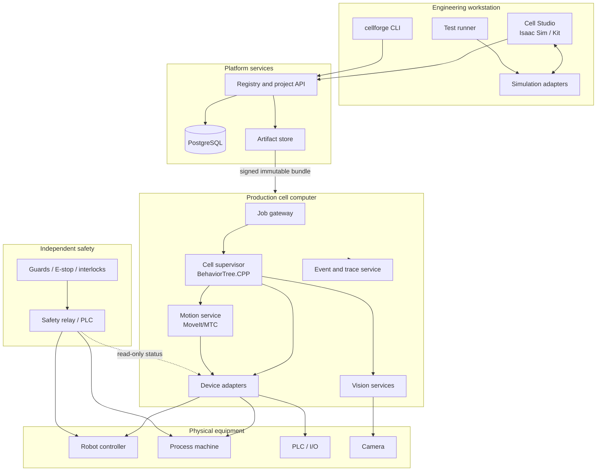

# CellForge System Specification

## 1. Product vision

CellForge is an internal platform for designing, simulating, validating, deploying, and operating modular industrial robot cells. It should reduce repeated engineering work by turning robots, tools, sensors, fixtures, and process machines into reusable supported components with common contracts.

The first automated process is pen laser engraving. The platform must not be specialized around engraving; engraving is the reference implementation used to prove the architecture.

## 2. Primary users

### Automation engineer

Creates cell scenes, configures devices, maps I/O, creates tasks, calibrates frames, simulates, and deploys.

### Process engineer

Defines process recipes and inspection limits without changing executable code.

### Operator

Selects approved jobs, sees status, follows guided recovery steps, and cannot edit engineering configuration.

### Maintainer

Diagnoses hardware, tests individual devices under controlled permissions, replaces components, and restores calibration.

### Software engineer

Adds component packages, skills, validators, drivers, UI panels, and test infrastructure.

### Safety engineer or qualified integrator

Defines and validates the independent safety architecture. CellForge records modeled safety dependencies and evidence but does not claim safety certification.

## 3. Product principles

1. **Simulation first, hardware second.** Every supported component should have a useful simulation adapter before its production driver is accepted.
2. **Same intent, different adapters.** Recipes, capabilities, and task logic are shared between simulation and hardware.
3. **Data over forks.** Product variation belongs in versioned recipes and component configuration, not copied programs.
4. **Explicit contracts.** Components declare capabilities, frames, ports, configuration schemas, and failure codes.
5. **Deterministic production core.** AI may estimate or classify; deterministic validators authorize actions.
6. **Independent safety.** Functional safety is implemented outside the general-purpose software stack.
7. **Immutable deployments.** A running cell identifies the exact bundle, recipe, code revision, calibration, and component versions used.
8. **Progressive complexity.** A fixed 2D-camera cell must not require the GPU and software needed for advanced 3D perception.
9. **Offline operability.** Production continues without cloud services or the Cell Studio workstation.
10. **Human-auditable recovery.** Faults are stable codes with declared recovery steps, not unexplained exceptions.

## 4. System contexts

### 4.1 Engineering context

The engineering workstation runs Cell Studio, Isaac Sim, ROS development tools, the local component registry client, and test runners. It may have a high-end NVIDIA GPU.

### 4.2 Production cell context

The cell computer runs only the selected runtime packages, drivers, configuration, and local production services. It may use a modest CPU-only computer unless the cell needs GPU perception.

### 4.3 Enterprise context

ERP/MES or an internal order service submits jobs and receives results through a versioned API. Enterprise systems never command robot joints or machine I/O directly.

### 4.4 Safety context

Safety-rated devices and logic independently enforce emergency stop, guard interlocks, safe robot stop, laser enable, and other required protective functions.

## 5. Top-level architecture

## 6. Core products

### 6.1 Cell Studio

A custom Isaac Sim / Omniverse Kit application extension that provides:

- project creation and version selection;
- component library browser;
- 3D scene authoring and mechanical attachment;
- frame and reach visualization;
- connection editor for software, I/O, and modeled safety dependencies;
- task editor backed by BehaviorTree.CPP XML;
- recipe editor generated from schemas;
- simulation controls and scenario runner;
- validation results;
- deployment bundle generation and comparison.

The studio is an engineering tool, not a production dependency.

### 6.2 Cell Runtime

A ROS 2 application deployed to each cell containing:

- job gateway;
- recipe loader and validator;
- BehaviorTree.CPP supervisor;
- reusable skill servers;
- MoveIt/MTC motion service when selected;
- vision services when selected;
- simulation or hardware device adapters;
- cell state aggregator;
- event, trace, and result recorder;
- local operator API.

### 6.3 Platform services

A small internal service layer containing:

- component registry;
- cell project metadata;
- recipe/version metadata;
- test evidence;
- deployment bundle metadata;
- job and production-result APIs;
- authentication and authorization integration.

The source assets and manifests remain in Git. PostgreSQL stores indexed operational metadata and immutable records rather than replacing source control.

## 7. Canonical artifacts

### 7.1 Component package

A versioned directory containing:

- `component.yaml` validated by `component.schema.json`;
- one or more USD assets;
- optional URDF/Xacro/SRDF;
- configuration schema;
- simulation adapter;
- hardware adapter or declared unsupported status;
- capability definitions;
- tests and documentation;
- license metadata for imported assets or vendor SDKs.

### 7.2 Cell project

A versioned directory containing:

- `cell.yaml` — canonical operational graph;
- `scene.usda` or `scene.usd` — canonical spatial scene;
- `behavior_tree.xml` — task orchestration;
- `recipes/` — development and approved recipe versions;
- `calibration/` — signed calibration artifacts;
- `scenarios/` — simulation test definitions;
- `deployment.yaml` — target profile;
- generated reports and evidence.

### 7.3 Deployment bundle

An immutable artifact containing:

- selected ROS packages and binary/container references;
- launch files;
- cell configuration;
- approved recipes;
- behavior trees;
- component manifests;
- calibration files;
- exact source revisions and dependency lock data;
- bundle manifest and hash;
- install and rollback metadata.

## 8. Component model

Supported component kinds:

- robot;
- end effector;
- sensor;
- process machine;
- fixture;
- conveyor;
- external axis;
- I/O module;
- product carrier;
- generic passive geometry;
- modeled safety device.

Every component declares:

- stable component type ID and semantic version;
- manufacturer and model metadata;
- supported variants;
- geometry and collision assets;
- named coordinate frames and mechanical mount points;
- configuration schema and defaults;
- capability implementations;
- software ports;
- industrial I/O ports;
- modeled safety requirements and status inputs;
- simulation adapter;
- hardware adapter;
- fault catalog;
- support level: simulated, bench-tested, production-qualified, deprecated.

## 9. Capability model

Task logic calls capabilities rather than manufacturer-specific methods.

Initial capabilities:

- `robot_motion.execute_trajectory`
- `robot_motion.move_to_pose`
- `gripper.open`
- `gripper.close`
- `fixture.clamp`
- `fixture.release`
- `vision.locate_object`
- `vision.inspect_object`
- `process.select_program`
- `process.execute_cycle`
- `io.read_signal`
- `io.write_signal`
- `conveyor.index`
- `operator.request_action`

A capability contract defines:

- typed inputs and outputs;
- preconditions;
- completion conditions;
- timeout behavior;
- cancellation behavior;
- idempotency expectations;
- simulation fidelity level;
- fault codes;
- required safety status inputs;
- whether it is allowed in dry-run mode.

## 10. Runtime control model

The cell supervisor is a centralized ROS 2 node using BehaviorTree.CPP. Other nodes are service-oriented capability providers.

The supervisor:

1. accepts a validated job;
2. loads the approved recipe and tree version;
3. checks cell and safety status;
4. ticks the behavior tree;
5. invokes ROS actions/services for skills and devices;
6. applies timeouts and cancellation;
7. records events and results;
8. enters a defined recoverable or terminal fault state.

MoveIt plans robot motion but does not decide the production sequence. Device adapters communicate with equipment but do not choose business logic. Vision estimates properties but does not authorize unknown process parameters.

## 11. Simulation model

Simulation uses the same ROS interfaces as hardware.

Minimum simulation levels:

- **L0 contract mock:** no physics; deterministic interface responses for unit tests.
- **L1 kinematic simulation:** robot joints, transforms, collision geometry, and programmed timing.
- **L2 physical cell simulation:** Isaac Sim physics, sensors, product movement, process timing, and fault injection.
- **L3 perception simulation:** rendered images, lighting variation, noise, synthetic labels, and AI inference.

A component manifest states its available simulation level. A deployment cannot claim a higher tested level than the weakest required component.

## 12. Recipe model

Recipes are immutable, versioned, validated data. They may reference approved machine programs but do not contain arbitrary executable code.

A recipe can define:

- product identity and allowed variants;
- required component capabilities;
- tool, fixture, and camera profiles;
- named work frames and offsets;
- motion parameters and speed scaling within authorized limits;
- machine program identifiers and permitted parameter ranges;
- vision methods and confidence thresholds;
- inspection acceptance criteria;
- timeouts and retry policy;
- traceability fields;
- compatibility constraints;
- approval status and evidence.

Only approved recipes may run in hardware mode. Development recipes may run only in simulation or explicitly authorized commissioning mode.

## 13. Job model

A job references:

- cell ID;
- recipe ID and exact version;
- task/tree ID and exact version;
- input payload such as text to engrave or batch metadata;
- expected quantity;
- priority and due metadata;
- idempotency key;
- requested execution mode: simulation, commissioning, or production.

The job gateway resolves and freezes all mutable references before execution.

## 14. State and fault model

Top-level cell states:

- `OFFLINE`
- `STARTING`
- `IDLE`
- `READY`
- `RUNNING`
- `PAUSED`
- `RECOVERABLE_FAULT`
- `TERMINAL_FAULT`
- `MAINTENANCE`
- `STOPPING`

Every fault has:

- stable code;
- component instance;
- severity;
- timestamp;
- operator message;
- technical detail;
- whether automatic retry is allowed;
- recovery procedure ID;
- evidence attachments;
- source exception only as supplemental data.

## 15. Deployment model

The studio or CLI validates and builds a deployment bundle. The cell agent installs a bundle into a versioned release directory, verifies its hash, runs preflight checks, and switches an atomic `current` link only after validation.

Rollback selects the previous known-good bundle. Recipes and calibration remain tied to the bundle manifest even if stored in shared directories.

Production runtime must boot automatically through systemd and expose a local health endpoint. Core hardware nodes run natively at first. Database/API/UI services may use containers where that does not compromise device access or deterministic startup.

## 16. Network model

Recommended zones:

- enterprise IT;
- engineering network;
- cell OT network;
- safety network or hardwired safety circuit.

The cell runtime accepts jobs only through the job gateway. It does not expose direct robot or process-machine commands to enterprise systems. Outbound internet is not required.

## 17. Permissions

Initial roles:

- viewer;
- operator;
- maintainer;
- process engineer;
- automation engineer;
- administrator.

Examples:

- operators may run approved jobs and acknowledge allowed recovery steps;
- process engineers may draft recipes but approval requires a second authorized role in production deployments;
- automation engineers may change cell configuration in development branches;
- maintenance mode commands require local presence and explicit enabling;
- no application role can bypass safety hardware.

## 18. Observability and traceability

Every job produces:

- unique trace ID;
- bundle ID;
- code revision;
- cell and component versions;
- recipe and tree versions;
- calibration versions;
- state transitions;
- device commands and results;
- measured poses and inspection results;
- fault and retry history;
- optional before/after images;
- final disposition.

High-rate raw topics are recorded selectively using rosbag2/MCAP. Structured job events are always stored locally and synchronized to the platform when available.

## 19. Safety boundary

The platform shall:

- read and display safety state;
- prevent normal task execution when required safety status is not healthy;
- model safety requirements in the cell project;
- generate safety-review checklists;
- record test evidence.

The platform shall not:

- implement emergency stop;
- implement guard locking;
- generate safety-rated robot stop signals over ordinary ROS;
- authorize laser emission through AI inference alone;
- permit software override of a failed interlock;
- claim standards conformity automatically.

## 20. Reference pen-engraving process

Reference sequence:

1. accept job containing approved pen SKU and engraving text;
2. validate recipe, text constraints, machine program, and cell bundle;
3. confirm safety and machine readiness;
4. locate or confirm pen in input carrier;
5. pick pen;
6. load keyed or rotary fixture;
7. verify seating and orientation;
8. move robot to declared safe process pose;
9. select approved laser program;
10. send variable text through the laser's documented interface;
11. execute process cycle through adapter handshake;
12. inspect mark location, contrast, and text;
13. unload and route pass/reject;
14. record result and evidence.

The laser adapter simulation shall model ready, busy, complete, fault, program mismatch, timeout, and interlock-not-ready conditions.

## 21. MVP success criteria

The first platform milestone is successful when an engineer can:

- start Cell Studio;
- create a pen-engraving project from a template;
- place one supported robot, gripper, camera, fixture, laser, and product;
- validate mechanical and software connections;
- run the complete cycle in simulation;
- inject at least five defined faults;
- execute automated scenario tests;
- export a runtime bundle;
- run the same behavior tree against mock hardware adapters without Isaac Sim;
- inspect a trace containing exact component, recipe, and bundle versions.

The first physical-cell milestone additionally requires real hardware adapters, independent safety validation, commissioning procedures, and production acceptance testing.
