# Architecture

## 1. Bounded contexts

### Studio context

Owns project editing, 3D scene authoring, connection authoring, simulation control, and deployment initiation.

### Registry context

Owns component metadata, versions, compatibility, support status, and searchable indexes.

### Recipe context

Owns recipe drafts, validation, approval state, compatibility, and immutable released versions.

### Runtime context

Owns job execution, state transitions, device interactions, trace generation, and local recovery.

### Deployment context

Owns build manifests, bundle hashes, target compatibility, install state, health checks, and rollback.

### Evidence context

Owns simulation results, commissioning evidence, calibration evidence, production records, and attachments.

## 2. Main services

| Service | Language | Runs where | Responsibility |
|---|---|---|---|
| `cellforge-cli` | Python | engineering/CI | validate, scaffold, build, test, package |
| `registry-api` | Python/FastAPI | internal server | component, project, recipe, deployment metadata |
| `artifact-store` | filesystem/S3-compatible | internal server | USD, bundles, images, reports |
| `studio-extension` | Python/Kit | engineering workstation | UI and scene authoring |
| `simulation-bridge` | Python/ROS 2 + Kit | engineering workstation/CI | deterministic scenario control, adapter registration, trace assertions, evidence |
| `job-gateway` | Python or C++ ROS node | cell | receive/freeze jobs, production mode checks |
| `cell-supervisor` | C++ ROS node | cell | BehaviorTree.CPP execution and state machine |
| `motion-service` | C++ ROS node | cell | MoveIt/MTC planning and execution |
| `vision-service` | C++/Python ROS nodes | cell | calibrated perception and inspection |
| `device-adapters` | C++/Python ROS nodes | cell | vendor and protocol integration |
| `state-aggregator` | C++ ROS node | cell | canonical cell/device status |
| `trace-recorder` | Python/C++ | cell | structured events and selective bag capture |
| `operator-api` | FastAPI | cell | local read/status/job/recovery endpoints |
| `bundle-agent` | Python/systemd | cell | install, validate, activate, rollback |

## 3. Dependency direction

```text
UI and CLI
    ↓
Application services
    ↓
Domain models and schemas
    ↓
Ports / capability contracts
    ↓
Simulation adapters or hardware adapters
```

Domain packages must not import Isaac Sim, ROS, FastAPI, or vendor SDKs. They contain pure models and validation logic.

Suggested code packages:

```text
src/python/cellforge_domain
src/python/cellforge_cli
src/python/cellforge_registry
src/python/cellforge_bundle
src/kit/cellforge_studio
ros_ws/src/cellforge_interfaces
ros_ws/src/cellforge_supervisor
ros_ws/src/cellforge_motion
ros_ws/src/cellforge_vision
ros_ws/src/cellforge_device_sdk
ros_ws/src/cellforge_adapters_*
```

## 4. Source of truth rules

- Git stores component package source, cell source, schemas, tasks, and code.
- `cell.yaml` stores operational component instances and connection semantics.
- USD stores spatial transforms, geometry composition, physics properties, and visual variants.
- Studio connection-canvas coordinates, aliases, selections, and routes are derived presentation
  metadata; they never replace immutable instance/port IDs or become a third operational source.
- PostgreSQL stores indexes, approvals, jobs, traces, and immutable release metadata.
- Deployment bundles contain frozen copies required for runtime.
- The runtime never queries Git during execution.

## 5. Cell compile pipeline

```mermaid
flowchart LR
  SRC[Cell source] --> SCHEMA[Schema validation]
  SCHEMA --> LINK[Instance and port linking]
  LINK --> SPATIAL[USD/frame validation]
  SPATIAL --> CAP[Capability resolution]
  CAP --> BT[Behavior-tree validation]
  BT --> RECIPE[Recipe compatibility]
  RECIPE --> TARGET[Target dependency resolution]
  TARGET --> TEST[Required test evidence check]
  TEST --> BUNDLE[Immutable deployment bundle]
```



The compiler returns all errors in one structured report where possible.

## 6. ROS graph

```text
/job_gateway
  action server: /cell/run_job
  publisher: /cell/job_state

/cell_supervisor
  consumes frozen job
  executes behavior tree
  clients: capability actions/services
  publisher: /cell/events

/state_aggregator
  subscribers: /devices/*/state, /safety/state
  publisher: /cell/state

/motion_service
  action server: /skills/move_to_pose
  action server: /skills/execute_manipulation
  clients: MoveIt / robot trajectory controller

/vision_locator
  action server: /skills/locate_object

/vision_inspector
  action server: /skills/inspect_object

/device/<instance_id>
  publishes canonical device state
  exposes capability-specific actions/services
```

Namespaces are generated from immutable component instance IDs, with a human-readable alias in metadata.

## 7. Execution modes

### Simulation

All devices use simulation adapters. Development recipes allowed. Physical outputs prohibited.

### Commissioning

Selected real adapters enabled. Restricted commands and reduced speed/process settings may be permitted through a locally enabled commissioning profile. Requires explicit operator and role controls.

### Production

Only released bundle, approved recipes, production-qualified adapters, valid calibration, and healthy safety state.

## 8. Compatibility model

A bundle resolver checks:

- ROS distribution and architecture;
- component package semantic-version constraints;
- adapter version and hardware firmware range;
- capability contract version;
- recipe schema version;
- cell project schema version;
- robot model and planning configuration;
- calibration target IDs;
- required test evidence level.

Compatibility failures block bundle generation rather than becoming runtime warnings.

## 9. Task 019 motion boundary

`cellforge_motion` exposes planner-neutral `MoveToPose` and `ExecuteManipulation` actions. Plan-only
and plan-and-execute use the same request; OMPL/KDL/controller selections remain deployment config,
not behavior-tree inputs. MTC builds the internal pick/load/unload stage graph while the behavior
tree continues to own the production sequence.

The planning scene is a derived runtime projection synchronized through the exact `cell.yaml` and
USD SHA-256 identities plus immutable component instance IDs. It does not become a third source of
truth. Cancellation requests MoveIt/controller stop and reports only the outcome certainty known by
the adapter; it is standard control, not functional-safety enforcement.

## 10. Task 021 deployment boundary

The bundle agent is the only component that mutates local release selection. It accepts a complete
content-addressed directory, verifies the canonical manifest plus full checksum inventory, matches
it against separately provisioned target facts, and installs it under its exact bundle ID. Release
contents are read-only; only the same-filesystem `current` symlink and protected files under
`/var/lib/cellforge` change during activation.

systemd owns runtime process lifecycle. A candidate becomes active only after a loopback health
response echoes its exact bundle ID; otherwise the previous known-good symlink, environment,
service, and health are restored. Secret identifiers cross the bundle boundary, but values exist
only in local protected storage/state. Deployment refusal and rollback are standard-control and
availability mechanisms and do not implement a safety-rated protective function.

## 11. Task 022 operator boundary

`cellforge_operator_api` is a loopback-only FastAPI service on the production cell. It consumes
canonical `CellState`/`JobEvent` data and calls only the fixed public job-gateway action and fixed
typed operator-action service. HTTP payloads and recovery configuration cannot select ROS topics,
services, actions, packages, executables, or device commands.

Bearer-token digests and the append-only audit database are cell-local protected state outside the
bundle. The approved recovery catalog is immutable bundle content binding stable fault codes to
semantic actions, instructions, confirmation text, and minimum roles. The runtime revalidates the
current state before acting. Platform availability is outside the local read/control path.

This is an operator and standard-control boundary. Safety status is display-only; neither a role nor
a recovery action can reset or bypass independent rated safety hardware.

## 12. Task 024 canonical behavior-tree boundary

The compiler freezes reviewed BehaviorTree node/port manifests and rejects tree/plugin contract
errors before bundle creation. At runtime the supervisor loads only the package libraries named by
the active immutable bundle and verifies the frozen manifest digest plus registration parity.
`cellforge_pen_bt_nodes` owns pen sequencing leaves and calls typed capability interfaces; it does
not import adapters, planner plugins, Python oracle code, vendor SDKs, or safety enforcement.

An uncertain process result is terminal to the current automatic sequence and requires explicit
reconciliation. Cancellation is forwarded to active actions but remains standard control. Rated
safety hardware independently enforces protective functions regardless of behavior-tree state.

## 13. Task 025 integrated runtime boundary

`cellforge_bringup` composes the bundle-selected L0 adapters, motion service, recovery coordinator,
state/trace services, supervisor and frozen plugin, gateway, and loopback operator API. Launch reads
only a verified immutable runtime graph from `manifest.json`; operator input cannot select graph
names or executables. Domain instance IDs retain hyphens, while ROS graph tokens encode them with
underscores (for example `laser-001` becomes `/device/laser_001/...`).

L0 is a deterministic contract runtime, not physics. L2 is refused as unavailable until a genuine
Isaac adapter exists. The coordinator validates semantic recovery against current state but has no
safety authority and never treats a missing fixed recovery service as success.

## 14. Task 033 qualification and platform synchronization boundary

Software release qualification validates the complete engineering-to-runtime platform without
requiring physical hardware:

- **Parity verification:** ensures behavior tree XML and recipe YAML contain zero simulator-specific
  conditional nodes or parameters, ensuring consistent execution across L0 and L2.
- **Scenario qualification matrix:** explicitly exercises nominal cycles, hardware/sensor faults,
  operator cancellation, execution timeouts, service restarts, corrupt bundles, offline platform
  outages, stale device heartbeats, and uncertain process outcomes.
- **Evidence & approvals:** enforces append-only two-role recipe approvals (disallowing author
  self-approval) and content-addressed evidence records with Ed25519 signing.
- **Local authority & idempotent sync:** production cell runtime operates independently with local
  SQLite job and trace storage, synchronizing idempotently with platform APIs (`POST /api/v1/sync/batch`)
  without data loss or duplicate records during network interruptions.
- **Signed qualification report:** cryptographic Ed25519 report capturing complete Git provenance,
  component/recipe digests, seed replay results, and mandatory functional safety disclaimers.
