# Architecture

## 1. Bounded contexts

### Studio context

Owns project editing, 3D scene authoring, connection authoring, simulation control, and deployment initiation.

### Registry context

Owns component metadata, versions, compatibility, support status, and searchable indexes.

### Recipe context

Owns recipe drafts, validation, approval state, compatibility, and immutable released versions.

### Runtime context

Owns job execution, state transitions, device interactions, trace generation, and local recovery.

### Deployment context

Owns build manifests, bundle hashes, target compatibility, install state, health checks, and rollback.

### Evidence context

Owns simulation results, commissioning evidence, calibration evidence, production records, and attachments.

## 2. Main services

| Service | Language | Runs where | Responsibility |
|---|---|---|---|
| `cellforge-cli` | Python | engineering/CI | validate, scaffold, build, test, package |
| `registry-api` | Python/FastAPI | internal server | component, project, recipe, deployment metadata |
| `artifact-store` | filesystem/S3-compatible | internal server | USD, bundles, images, reports |
| `studio-extension` | Python/Kit | engineering workstation | UI and scene authoring |
| `simulation-bridge` | Python/ROS 2 + Kit | engineering workstation/CI | deterministic scenario control, adapter registration, trace assertions, evidence |
| `job-gateway` | Python or C++ ROS node | cell | receive/freeze jobs, production mode checks |
| `cell-supervisor` | C++ ROS node | cell | BehaviorTree.CPP execution and state machine |
| `motion-service` | C++ ROS node | cell | MoveIt/MTC planning and execution |
| `vision-service` | C++/Python ROS nodes | cell | calibrated perception and inspection |
| `device-adapters` | C++/Python ROS nodes | cell | vendor and protocol integration |
| `state-aggregator` | C++ ROS node | cell | canonical cell/device status |
| `trace-recorder` | Python/C++ | cell | structured events and selective bag capture |
| `operator-api` | FastAPI | cell | local read/status/job/recovery endpoints |
| `bundle-agent` | Python/systemd | cell | install, validate, activate, rollback |

## 3. Dependency direction

```text
UI and CLI
    ↓
Application services
    ↓
Domain models and schemas
    ↓
Ports / capability contracts
    ↓
Simulation adapters or hardware adapters
```

Domain packages must not import Isaac Sim, ROS, FastAPI, or vendor SDKs. They contain pure models and validation logic.

Suggested code packages:

```text
src/python/cellforge_domain
src/python/cellforge_cli
src/python/cellforge_registry
src/python/cellforge_bundle
src/kit/cellforge_studio
ros_ws/src/cellforge_interfaces
ros_ws/src/cellforge_supervisor
ros_ws/src/cellforge_motion
ros_ws/src/cellforge_vision
ros_ws/src/cellforge_device_sdk
ros_ws/src/cellforge_adapters_*
```

## 4. Source of truth rules

- Git stores component package source, cell source, schemas, tasks, and code.
- `cell.yaml` stores operational component instances and connection semantics.
- USD stores spatial transforms, geometry composition, physics properties, and visual variants.
- PostgreSQL stores indexes, approvals, jobs, traces, and immutable release metadata.
- Deployment bundles contain frozen copies required for runtime.
- The runtime never queries Git during execution.

## 5. Cell compile pipeline

```mermaid
flowchart LR
  SRC[Cell source] --> SCHEMA[Schema validation]
  SCHEMA --> LINK[Instance and port linking]
  LINK --> SPATIAL[USD/frame validation]
  SPATIAL --> CAP[Capability resolution]
  CAP --> BT[Behavior-tree validation]
  BT --> RECIPE[Recipe compatibility]
  RECIPE --> TARGET[Target dependency resolution]
  TARGET --> TEST[Required test evidence check]
  TEST --> BUNDLE[Immutable deployment bundle]
```



The compiler returns all errors in one structured report where possible.

## 6. ROS graph

```text
/job_gateway
  action server: /cell/run_job
  publisher: /cell/job_state

/cell_supervisor
  consumes frozen job
  executes behavior tree
  clients: capability actions/services
  publisher: /cell/events

/state_aggregator
  subscribers: /devices/*/state, /safety/state
  publisher: /cell/state

/motion_service
  action server: /skills/move_to_pose
  action server: /skills/execute_manipulation
  clients: MoveIt / robot trajectory controller

/vision_locator
  action server: /skills/locate_object

/vision_inspector
  action server: /skills/inspect_object

/device/<instance_id>
  publishes canonical device state
  exposes capability-specific actions/services
```

Namespaces are generated from immutable component instance IDs, with a human-readable alias in metadata.

## 7. Execution modes

### Simulation

All devices use simulation adapters. Development recipes allowed. Physical outputs prohibited.

### Commissioning

Selected real adapters enabled. Restricted commands and reduced speed/process settings may be permitted through a locally enabled commissioning profile. Requires explicit operator and role controls.

### Production

Only released bundle, approved recipes, production-qualified adapters, valid calibration, and healthy safety state.

## 8. Compatibility model

A bundle resolver checks:

- ROS distribution and architecture;
- component package semantic-version constraints;
- adapter version and hardware firmware range;
- capability contract version;
- recipe schema version;
- cell project schema version;
- robot model and planning configuration;
- calibration target IDs;
- required test evidence level.

Compatibility failures block bundle generation rather than becoming runtime warnings.

## 9. Task 019 motion boundary

`cellforge_motion` exposes planner-neutral `MoveToPose` and `ExecuteManipulation` actions. Plan-only
and plan-and-execute use the same request; OMPL/KDL/controller selections remain deployment config,
not behavior-tree inputs. MTC builds the internal pick/load/unload stage graph while the behavior
tree continues to own the production sequence.

The planning scene is a derived runtime projection synchronized through the exact `cell.yaml` and
USD SHA-256 identities plus immutable component instance IDs. It does not become a third source of
truth. Cancellation requests MoveIt/controller stop and reports only the outcome certainty known by
the adapter; it is standard control, not functional-safety enforcement.

## 10. Task 021 deployment boundary

The bundle agent is the only component that mutates local release selection. It accepts a complete
content-addressed directory, verifies the canonical manifest plus full checksum inventory, matches
it against separately provisioned target facts, and installs it under its exact bundle ID. Release
contents are read-only; only the same-filesystem `current` symlink and protected files under
`/var/lib/cellforge` change during activation.

systemd owns runtime process lifecycle. A candidate becomes active only after a loopback health
response echoes its exact bundle ID; otherwise the previous known-good symlink, environment,
service, and health are restored. Secret identifiers cross the bundle boundary, but values exist
only in local protected storage/state. Deployment refusal and rollback are standard-control and
availability mechanisms and do not implement a safety-rated protective function.
